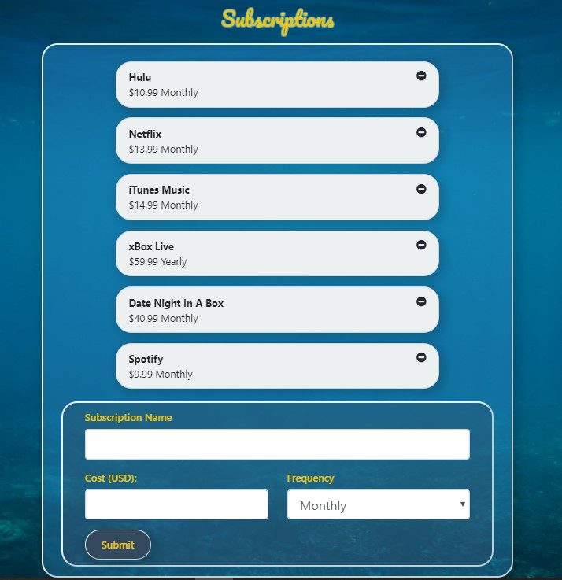
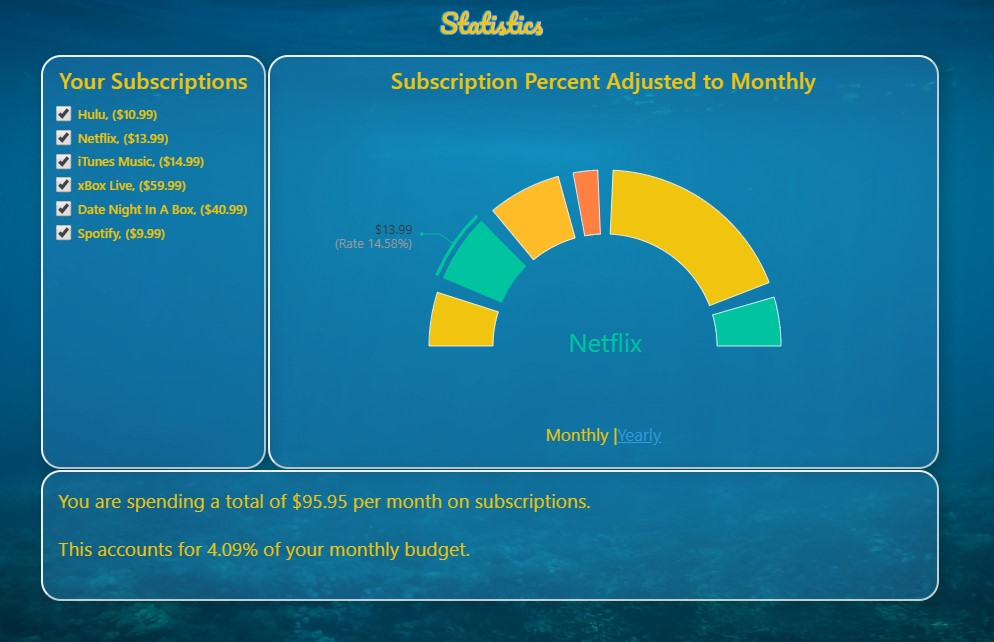

## Submarine Sub Tracker
<h3>Developed by: </h3>
<ul>
<li> Nico Barbarese
<li> Casey Carroll
<li> Nathan Hill
</ul>

<h2>How much do you pay every month in subscriptions?</h2>

This is something nearly every person has asked themselves at least once, sometimes more than once. What if there were a way for you to easily keep track of all of your Weekly, Monthly, and Yearly subscriptions all in one place? This is exactly why we developed the Submarine subscription tracker. After you sign up and enter in some basic data, you can go to your Subscriptions page and add all of your subscriptions to your list. It is simple, fast, and easy to get started. 

 

Once you have all of these subscriptions entered, you might be thinking "Now what?" This is when you tab over to the Statistics page. Here, you get some clear and concise information about all of your subscriptions, including monthly and yearly totals. You are even able to see what your budget looks like if you were to drop one or more of those subscriptions and see what your updated figures look like in real time!

 

<h2>About Submarine and it's developers</h2>
Submarine was developed as a final project for the Penn LPS Coding Boot Camp. It is built on a full MERN stack, meaning it uses MongoDB as it's database, a Node.js server written using Express, and React on the front end. 
<ul>
<li> <strong>Nico Barbarese</strong> - Nico came up with the original idea for Submarine, and was the primary coder for our Subscriptions page as well as the React Router and much of the front-end utility code that connected the app to the server.
<li> <strong>Casey Carroll</strong> - Casey was our UX/UI designer, and as such was responsible for the overall look of the website, as well as the mobile responsiveness of the site. he also coded our our NavBar and our login Page. 
<li> <strong>Nathan Hill</strong> - The man behind the curtain, Nathan coded the Express web server and the Mongoose model for the database. He also contributed to the front-end a little, helping to make the Statistics page interactive. 
</ul>
 
 
<h2>Next Steps</h2>

There are some bugs to fix (yes, we know about those) and definitely some enhancements to add. Once the bugs are resolved, our first plan is to add categories to the subscriptions. This will allow us to give the user some more detailed statistics about their subscriptions plans, such as multiple plans that may overlap or perhaps some more inexpensive options. We also want to look at the entirety of our data and how that could be useful to the user, or to us as we plan next steps for the web application. 
  To try the app out, please check out our <a href="https://submarine-sub-tracker.herokuapp.com/">Deployed Website</a> on Heroku and use the user name "guest" and password "guest" to log in and play around. 

Thank you for taking a look at the Submarine subscriptions tracker!